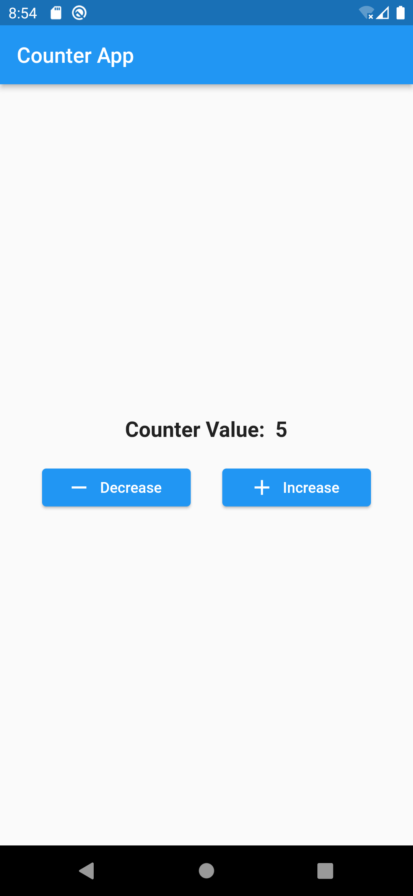

# Counter App

Simple counter flutter app using bloc. To understand basic concept about bloc state management
tool, I have build this app. It holds the value of counter and also save it in local storage. So
that, when app relaunch it show the last value of counter.

# Screenshots

  
